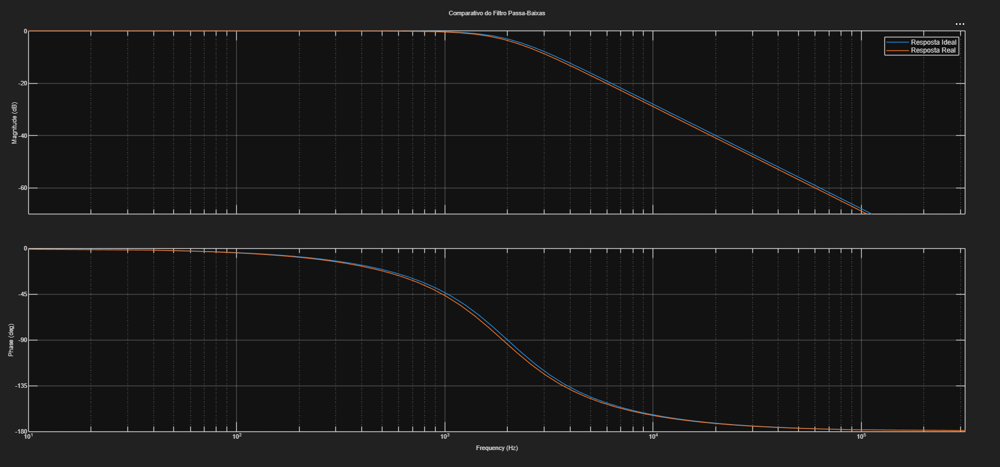
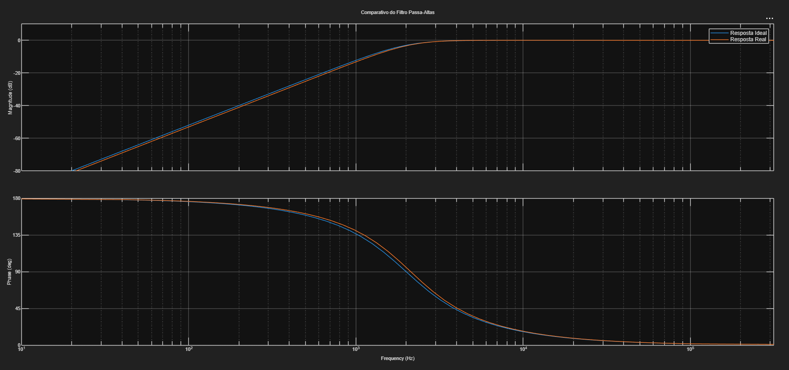

# Projeto de Filtros de Crossover de Áudio (Passa-Baixas e Passa-Altas)

**Autor:** Guilherme Giongo Sartor

## C. Apresentação do Problema
Em sistemas de áudio de alta fidelidade, um único alto-falante não consegue reproduzir todas as frequências audíveis com eficiência. Para resolver isso, utilizam-se múltiplos alto-falantes (como woofers para graves e tweeters para agudos). O desafio de engenharia é garantir que cada alto-falante receba apenas a faixa de frequência para a qual foi projetado, evitando distorções e danos físicos aos componentes. Este projeto implementa uma ferramenta computacional para projetar filtros passivos (crossover) que separam esses sinais.

## D. Objetivos e Especificações de Projeto
O objetivo principal é calcular os componentes ideais e selecionar os componentes comerciais mais próximos para uma rede de crossover passiva de 2 vias.

**Parâmetros de Projeto:**
* Tipo de Filtro: Butterworth de 2ª Ordem (Fator de Qualidade Q = 0.707)
* Frequência de Corte (fc): 2000 Hz
* Impedância da Carga (Alto-falantes): 8 Ohms

## E. Funções de Transferência e Fórmulas
Para a modelagem matemática, assumiu-se as seguintes funções de transferência (H(s)) no domínio de Laplace:

**Filtro Passa-Baixas (Woofer):** Circuito RLC série com a saída sobre o capacitor.
H(s) = (1/LC) / (s^2 + (R/L)s + 1/LC)

Fórmulas derivadas para o projeto:
1. L = (R * Q) / Wc
2. C = 1 / (L * Wc^2)

**Filtro Passa-Altas (Tweeter):** Capacitor em série com um indutor e resistor em paralelo (saída sobre o resistor).
H(s) = s^2 / (s^2 + (1/RC)s + 1/LC)

Fórmulas derivadas para o projeto:
1. C = Q / (R * Wc)
2. L = 1 / (C * Wc^2)

*Nota: Wc é a frequência angular, dada por Wc = 2 * pi * fc.*

## F. Lógica do Programa
O script foi desenvolvido em MATLAB e segue o seguinte fluxo algorítmico:
1. **Entrada de Dados:** Recebe fc, Impedância e Q.
2. **Cálculo Ideal:** Aplica as fórmulas deduzidas para encontrar L e C em Henrys e Farads.
3. **Conversão e Busca:** Converte os valores para mH e uF e percorre vetores contendo as séries comerciais de componentes, utilizando a função `min(abs(...))` para encontrar o componente com o menor desvio absoluto.
4. **Modelagem:** Converte os componentes reais de volta para o Sistema Internacional e cria objetos de sistemas dinâmicos usando a função `tf()`.
5. **Visualização:** Plota a resposta em frequência (Ideal vs. Real) usando a função `bode()` com o eixo X formatado em Hertz.

## G. Como executar o código
1. Certifique-se de ter o MATLAB instalado, juntamente com o pacote `Control System Toolbox`.
2. Faça o clone deste repositório.
3. Abra o arquivo `trabalho_ca.m` no MATLAB e clique em **Run** (ou pressione F5).
4. O Command Window solicitará os parâmetros. Digite:
   - Frequência de corte: `2000`
   - Impedância: `8`
   - Fator de Qualidade: `0.707`
5. Os valores calculados serão impressos no console e duas janelas com os Gráficos de Bode serão abertas automaticamente.

## H. Análise dos Resultados

### Componentes Calculados vs. Comerciais
| Filtro | Componente | Valor Ideal | Valor Comercial Sugerido | Frequência de corte ideal | Frequência de corte real |
| :--- | :--- | :--- | :--- | :--- | :--- |
| **Passa-Baixas** | Indutor (L) | 0.45mH | 0.47mH | 2000.0Hz | 1895.51Hz |
| | Capacitor (C) | 14.07uF | 15.00uF | | |
| **Passa-Altas** | Indutor (L) | 0.90mH | 0.82mH | 2000.0Hz | 2131.37Hz |
| | Capacitor (C) | 7.03uF | 6.80uF |
| |

### Gráficos Comparativos (Bode)
*(Abaixo estão os gráficos gerados pela ferramenta)*

## iii. Análise Crítica
Ao substituir os valores ideais matemáticos pelos valores da série comercial, observou-se que a frequência de corte real do filtro se deslocou para aproximadamente  Hz no Passa-Baixas e [XXX] Hz no Passa-Altas. 

O maior desvio percentual ocorreu no [diga se foi o indutor ou capacitor do PB ou PA], onde o valor comercial ficou [X]% distante do ideal. Na prática, um pequeno deslocamento na frequência de corte (como o observado nos gráficos) gera uma leve zona de sobreposição (overlap) ou um pequeno "buraco" na resposta de frequência da caixa de som ao redor dos 2kHz. No entanto, considerando as tolerâncias naturais dos alto-falantes mecânicos, essa diferença provocada pelos componentes padronizados [conclua se seria audível ou desprezível para um ouvido não treinado].

## iv. Conclusões
O projeto cumpriu os requisitos especificados, entregando uma ferramenta funcional capaz de automatizar o projeto de crossovers.
